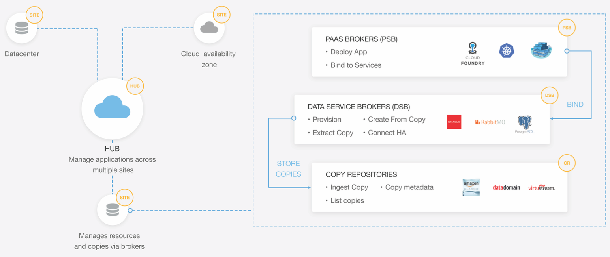

Ocopea Kubernetes Extension
======================

Ocopea extension for Kubernetes is an extensible application-level copy management extention for [kubernetes](https://kubernetes.io).


## Description
Ocopea kubernetes extension significantly simplifies copy management of complex multi-microservice apps. untangling complexity of scheduled backups, orchestrating restoration of copies for test-dev use cases and automated tests are the some of the most common tasks our rich API and UI offers.
The focus of the project is to simplify the management of modern apps state by standardizing stateful services APIs and ubiquitous language. Our extensible APIs enable support for any type of stateful service(Data Service), Backend storage, and copy target. Whether your data is stored on an RDS database on AWS or on premises on DB2 - Ocopea is built to suit your needs.
Integrated with popular developer tools the extension comes with features that would speed up the development process and boost the quality of the pipeline tests.

Ocopea kubernetes extension supports the following functions:

## Workflows
- Take periodic backups of multi-container apps for all the supported data services
- Restore backups to running app instances
- Manage developer hydrated and running copies of app versions

## Support matrix
- Built in support for mongodb and mysql backups
- Simple api and UI for adding support for additional database support (either SaaS e.g. AWS RDS, or google spanner) or self managed (e.g. Oracle, DB2 on premises)
- Simple api and UI for adding support for persistent volume snapshot manager (e.g. AWS EBS, google persistent disks)
- Default built in target storage for backups (Copy Repository) based on postgres large objects
- Simple api and UI for extending target storage (Copy Repository Brokers) for other platforms (e.g. AWS glacier, Google nearline, or an on premise PBBA like Datadomain)
- Integrate with private docker registries to store app image copies

## Developer tools

- Allows integration with registered and supported third party tools such as Jira and Pivotal tracker to enable test dev workflows, by allowing tracking of copies to related issues.
- API for managing pipeline automated tests with real data


## Open Service Broker (OSB)

The Ocopea project loves [Open Service Broker](https://openservicebrokerapi.org), and our maintainers are involved in the OSB committee. Our vision is to make software simpler to build by allowing vendors to publish their services with data protection built in using the OSB backup & restore natives

## Architecture


*Ocopea hish level compoents*



The real workhorses of Ocopea are Sites. Sites are the Ocopea representative on each physical location (geographical). a site could be an on premises datacenter or a public cloud availability zone.
The site component communicates with the kubernetes cluster (or other supported schedulers/PaaS) and manages all data resources available to the applications. It is identified by a user provided/public cloud name and its location (e.g. AWS US West2 ).
The site does its work using a set of **Brokers**:

**Data Service Broker (DSB)**: 
Every data service such as databases, file systems, kubernetes volume, object store, messaging services, email etc. are interfaced to the site by a DSB. The DSB interface allows provisioning and managing the resources as well as monitoring health and status. DSBs are also in charge of keeping data interface compatibility if required to enable mobility of the application between platforms. They are also aware of SLOs of the service and may publish or adjust services accordingly.
In our vision we see OSB encapsulating and deprecating the DSB concept

**PaaS Service Broker (PSB)**: 
Each container scheduler has its own configuration parameters and runtime model. This solution focuses on kubernetes.The PSB interface will be able to provision and manage compute resources on the PaaS.


DSBs can come in two flavors:
Encapsulating DSB: The DSB is a wrapper around a service provided by the platform. An example is a DSB for Amazon S3 running on Amazon. AWS provide the functionality and the DSB encapsulates this functionality.
Managed DSB: The DSB is in charge of the functionality as well as the interface. An example would be creating an instance of the open source Minio S3 compatible object store to provide services when running outside of AWS or on a developer’s laptop.
To generalize we use the term DSB backing to describe the provider of functionality of the DSB. In the examples above Amazon is the backing of the first S3 DSB, while Minio is the backing of the second.


**Copy Repository Broker**: 
Repositories are interfaces to manage and manipulate copies (usually passive copies). The interface will allow enumerating and retrieving copies and their metadata, create new copies, transfer copies to other copy repositories and restore copies to new locations. Copy repositories can decide to create copies on their own by schedule, event or any other reason. The important thing is that all copies be exposed to via the interface to the outside world so that the copies can be used. An example is a copy repository interface DataDomain instance. Another would be using Amazon glacier as a copy repository. copy repositories expose to DSB copy protocols to use for dumping copies (e.g. NFS share, S3 API etc.)
 

The Ocopea Site is the glue that makes an applications dance using extensible brokers. The brokers swagger definition are available [here][todo.com] - we welcome and reward commynity brokers

While Sites are a powerful construct, the real power comes from aggregating sites together into a fully managed multi-cloud fabric. The Hub is an optional Ocopea component that communicates with the different sites, combining the knowledge about health and status of all locations, merging copy information, and orchestrating operations across sites. 
The hub does not do any heavy lifting of data. All data transfer operations are done directly between the components that hold the data. In that sense the hub is a powerful orchestrator and matchmaker, like a huge Tinder in the sky.  


## Other platforms
while Ocopea supports multiple schedulers and PaaS platforms for running cloud native apps, this flavor is an effort to make the kubernetes support easier
It integrates data and copy service brokers with PCF and K8s environment and provides ability to orchestrate copying and restoring user application and its data.
Project Ocopea is an application-level copy management orchestrator for cloud native apps.

## Installation
All you'll have to do in order to start using ocopea is clone this repo under your go root and start playing

## Usage Instructions
deploying ocopea site on your kubernetes cluster is as simple as running the following command:

```bash

# configuring kubectl proxy avoiding passing k8s cluster credentials to ocopea
kubectl proxy -p 8080

# deploying the default site settings
go run deployer.go deploy-site -local-cluster-ip=[k8s cluster ip]

```


## Kubernetes snapshot
There are several initiatives to add volume snapshots natively to kubernetes, the Ocopea maintainers are actively participating and waiting for the inclusion of the snapshot api as part of kubernetes by the [Kubernetes Storage SIG](https://github.com/kubernetes/community/tree/master/sig-storage)

## Future
For being useful ocopea needs to integrate with as many "Data Services" as possible. while OSB initiative is aiming to resolve that, until then we plot:
 - Integrating with AWS APIs for RDS
 - Integrating with AWS APIs for AWS Snapshots
 - User management and authentication integration
 - Selected on premises CRB implementation (PBBA)

 

## Contribution
Create a fork of the project into your own reposity. Make all your necessary changes and create a pull request with a description on what was added or removed and details explaining the changes in lines of code. If approved, project owners will merge it.

Licensing
---------
**{code} does not provide legal guidance on which open source license should be used in projects. We do expect that all projects and contributions will have a valid open source license within the repo/project, or align to the appropriate license for the project/contribution.** The default license used for {code} Projects is the [MIT License](http://codedellemc.com/sampledocs/LICENSE "LICENSE").

Ocopea kubernetes extension is freely distributed under the [MIT License](http://emccode.github.io/sampledocs/LICENSE "LICENSE"). See LICENSE for details.


Support
-------
Please file bugs and issues on the Github issues page for this project. This is to help keep track and document everything related to this repo. For general discussions and further support you can join the [{code} Community slack channel](http://community.codedellemc.com/). The code and documentation are released with no warranties or SLAs and are intended to be supported through a community driven process.